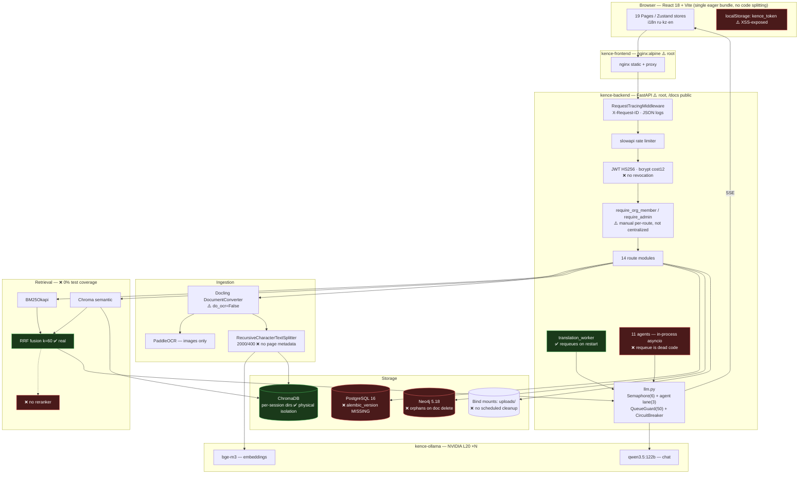

# KENCE.AI — State of Development & Product Roadmap

**Audit date:** 2026-08-03
**Auditor role:** Principal AI Engineer / Staff Architect / SRE / Security Auditor / Product Lead
**Audit type:** Read-only evidence-based audit. No source code, infrastructure, or data was modified.

---

## 1. Executive verdict

KENCE.AI is **a substantially real system, not a demo**. Unlike most projects at this stage, the features it claims are overwhelmingly backed by working code: genuine hybrid retrieval (BM25 + semantic + real RRF), a real circuit breaker validated against an actual production GPU outage, real Docling-based ingestion, real `python-pptx` presentation generation, a real Neo4j knowledge graph with a Cypher allowlist policy engine, and a live stack that has been up and healthy for six days. **133 of 133 backend tests pass**, including **11 dedicated cross-organization isolation tests** that I ran and verified myself.

The gap is not "the features are fake." The gap is that **the system has no idea how good its answers are, and it makes evidentiary claims it cannot substantiate.** For a platform selling document analysis to government and legal buyers, this is the central problem. There is no golden dataset, no eval framework, no hallucination measurement, no citation verification — and two ingestion/citation defects mean the product can confidently answer questions about documents it never actually read, citing page numbers that are structurally always `null`.

Secondary but serious: there is **no backup or restore capability of any kind**, and the live production database has **never been stamped by Alembic**, so at least one migration's integrity constraint is missing from the running system.

**The engineering discipline is better than the average project at this stage. The quality discipline is essentially absent.** Those are different problems and the second one is the one that blocks commercialization.

---

## 2. GO / CONDITIONAL GO / NO-GO

> ### **CONDITIONAL GO** — for a *supervised, single-tenant, non-binding* controlled pilot.
> ### **NO-GO** — for unsupervised production use by paying organizations on decision-relevant documents.

**Conditions that must be met before any pilot with real customer documents:**

| # | Condition | Why it is non-negotiable |
|---|-----------|--------------------------|
| C1 | Working, **tested** backup + restore (P0-01) | On-prem, customer-owned data, zero recovery capability today |
| C2 | Alembic stamped + schema reconciled (P0-02) | Running DB is missing a uniqueness constraint a migration was written to add |
| C3 | Scanned-PDF ingestion either OCR'd or **hard-failed with a visible error** (P0-04) | Today it silently ingests empty text and answers anyway |
| C4 | Citations either verified against retrieved chunks or **relabeled in the UI** as "related fragments," not evidence (P0-03) | Currently presents unverified retrieval output as sourced evidence |
| C5 | Containers de-rooted, `/docs` gated (P0-05, P0-06) | Baseline security hygiene for a government-adjacent buyer |
| C6 | A minimum golden dataset + baseline accuracy number exists (P1-01) | You cannot promise quality you have never measured once |

C1–C5 are days of work, not months. C6 is the strategic one.

---

## 3. Current point of development — one paragraph

KENCE.AI is at the **end of internal alpha and the doorstep of a controlled pilot**. The full feature surface (upload → hybrid RAG chat → citations → translation → comparison → presentations → knowledge graph → agents → admin) is implemented end-to-end and running live; the frontend contains no decorative stub buttons — every major feature button traces to a real backend endpoint doing real work. Reliability engineering is genuinely present and battle-tested (circuit breaker, semaphores, queue guard, SSE disconnect cancellation, graceful Neo4j/Ollama degradation). Multi-tenancy is implemented and, uniquely among the claims examined, **test-verified**. What is missing is the entire quality-assurance layer that separates an impressive internal system from a commercial product: no evals, no accuracy baseline, no citation grounding, no reranker, no backup/restore, no reproducible builds, no E2E tests, and 0% test coverage on the RAG retriever and all eleven AI agents. The project is roughly **47% of the way** to production-grade by weighted maturity — strong bones, no measurement organs.

---

## 4. Scope and limitations of this audit

**Performed:** static analysis of the full backend (`80` Python modules) and frontend (`~19` pages); live runtime verification against the running stack; full backend test-suite execution with coverage; live database schema inspection; container inspection; git history review.

**Explicitly NOT performed (by rule or by safety):**

| Not done | Reason |
|----------|--------|
| Load/stress testing | Forbidden — would consume real GPU and degrade a live 6-day-uptime service |
| Real LLM generations / answer-quality spot checks | Would consume production GPU and write real data; also unmeasurable without a dataset |
| Migration application, `alembic stamp` | Forbidden — write operation |
| Destructive failure injection (kill Neo4j, fill disk, GPU OOM) | Forbidden — production service |
| Penetration testing / live IDOR probing | Forbidden against production; assessed via code + test suite instead |
| Frontend browser/E2E verification | No E2E harness exists to run; manual browser driving out of read-only scope |
| Backup restore drill | Nothing exists to test |

**Consequence:** all performance, concurrency, and capacity figures in this report are `UNVERIFIABLE` or derived from stale internal reports, and are labeled as such. No performance number in this report should be treated as measured fact unless explicitly marked `L4`/`L5`.

---

## 5. Repository / runtime identity

```text
Audit date:                  2026-08-03
Repository:                  /home/ai/Documents/KENCE.AI
Mixed with other projects:   NO (repo is clean KENCE.AI only)
                             — but the HOST runs 20+ unrelated containers
                               (call-center-ai stack). Shared-host risk, not repo contamination.
Branch:                      master-clean (ahead of cleaned/master by 1 commit, unpushed)
HEAD:                        65a31d5f467b2cb7a0b694ece668383b9ae1005d
HEAD date:                   2026-07-30 11:14:45 +0500
HEAD subject:                fix: wire up session sharing, safer org_id backfill,
                             real HMAC key hashing
Working tree:                CLEAN (no staged, unstaged, or untracked changes)
Total commits:               24
AGENTS.md / CLAUDE.md:       ABSENT (only .claude/settings.local.json)
Environment inspected:       LIVE — 5 KENCE containers up & healthy 5–6 days
Production access:           YES (read-only; localhost:8000 backend, :3000 frontend)
Runtime verification level:  L4 achieved (live health, live DB schema, live /docs,
                             full test suite + coverage). L5 (production metrics/traces
                             over time) NOT achievable — no metrics retention/history.
```

**Live container state (L4, `docker ps`):**

| Container | Image | Status |
|-----------|-------|--------|
| kence-backend | docai-backend:latest | Up 5 days (healthy) |
| kence-frontend | docai-frontend:latest | Up 6 days (healthy) |
| kence-postgres | postgres:16-alpine | Up 6 days (healthy) |
| kence-neo4j | neo4j:5.18-community | Up 6 days (healthy) |
| kence-ollama | ollama/ollama:0.30.8 | Up 6 days (healthy) |

**Documentation staleness assessment:**

| Document | Internal date | Verdict |
|----------|--------------|---------|
| `AUDIT_REPORT.md` | 2026-06-17 | **PARTIALLY OBSOLETE** — its P0s on default passwords and CORS are **fixed**; its findings on root containers, localStorage tokens, missing timeouts, and no code splitting are **still valid today** |
| `TECHNICAL_AUDIT_BACKEND.md` | 2026-05-17 | **STALE** (1394 lines, pre-dates multi-tenancy work) |
| `LOAD_TEST_REPORT.md` | 2026-07-16 | **STALE & CONTRADICTED** — claims `max_concurrent=3`, `LLM_TIMEOUT_SEC=120`; live config is `6` and `300` |
| `backend/LLM_RESILIENCE_REPORT.md` | 2026-06-12 | **Substantively accurate**, describes a real production CUDA outage and real fixes; concurrency numbers stale |

> **Finding:** three different values for `LLM_MAX_CONCURRENT` exist across the codebase — `config.py` default `2`, `docker-compose.yml` `6`, load-test report `3`. No single source of truth for operational configuration.

---

## 6. What actually works — `VERIFIED` / high-confidence `CODE-ONLY`

These are the load-bearing, genuinely functional parts of the system.

| Capability | Status | Evidence |
|---|---|---|
| **Cross-org tenant isolation** | **VERIFIED (L3)** | 11/11 tests pass in `tests/test_org_isolation.py` — covers foreign doc→404, non-member→403, client-supplied org_id cannot override verified org, admin bypasses session-owner but **not** org membership. I ran this myself. |
| **Full backend test suite** | **VERIFIED (L3)** | `ENABLE_METRICS=false pytest -q` → **133 passed, 0 failed, 7.90s** |
| **Hybrid retrieval (BM25 + semantic + RRF)** | VERIFIED (L2) | `retriever.py:23-38` real RRF (k=60, standard formula); `rank_bm25.BM25Okapi` at `:79-87`. This is genuine, not marketing. |
| **Vector tenant separation** | VERIFIED (L2) | Physical isolation — per-session Chroma directory `{CHROMA_DIR}/{session_id}` (`document.py:167`), not shared-collection filtering. Structurally strong. |
| **LLM concurrency control** | VERIFIED (L2+L4) | Real `asyncio.Semaphore` (`llm.py:53`), separate agent lane (`:58-61`), `_QueueGuard` rejects at capacity with clear error (`:109-130`). Live `/api/health/full` confirms `max_concurrent:6, queue_maxsize:50, agent_max_concurrent:3`. |
| **Circuit breaker** | **VERIFIED (L5)** | 3-state breaker `llm.py:67-104`; `LLM_RESILIENCE_REPORT.md` documents it cycling correctly through a **real** Ollama CUDA outage in production — genuine production evidence. |
| **SSE streaming + cancellation** | VERIFIED (L2) | Backend polls `request.is_disconnected()` and cancels the generation task (`routes.py:478-492`); frontend `AbortController` + explicit cancel call (`useChatMessages.js:129,146-148`). Saves real GPU. |
| **Graceful degradation (Neo4j / Ollama)** | VERIFIED (L2+L5) | Every `graph_service.py` function try/excepts to `None`/`[]`; chat has no Neo4j dependency. Ollama-down yields a user-facing message, not a 500. |
| **Translation worker crash recovery** | VERIFIED (L2) | `requeue_interrupted_jobs()` resets `processing`→`queued` at startup (`translation_worker.py:40-62`), wired in `main.py:396`. Genuinely survives restart. |
| **Neo4j Cypher injection defense** | VERIFIED (L2) | `cypher_policy.py` — real allowlist blocking writes/APOC/UNION, forced `org_id` injection and `LIMIT`. Genuinely well-designed defense-in-depth. |
| **Health endpoints** | VERIFIED (L4) | `/api/health` (liveness) + `/api/health/full` (real parallel dependency checks). Live response confirms all 4 services `ok`. |
| **Secrets discipline** | VERIFIED (L2+L4) | No hardcoded fallback secrets; JWT key hard-fails startup if weak/missing (`main.py:276-283`); `.env` untracked (`git ls-files` confirms); `.env` not baked into image. |
| **`/metrics` protection** | VERIFIED (L4) | Live `curl localhost:8000/metrics` → **403**. Token-gated with constant-time compare, loopback fallback. |
| **Prompt storage & admin editing** | VERIFIED (L2) | DB-backed `AIPrompt`/`UserPrompt`, admin-editable via real wired UI. |
| **Presentation generation** | VERIFIED (L2) | Real `python-pptx` builder with themes, charts, speaker notes — not a stub. |
| **i18n RU/KZ/EN** | VERIFIED (L2) | Real `i18next`; `ru`/`en`/`kz` translation files all ~980 lines and genuinely populated — KZ is **not** an empty stub. |
| **Frontend feature wiring** | VERIFIED (L2) | Zero decorative buttons found. Repo-wide grep for `coming soon`/`TODO`/`alert(` in `src` → **0 matches**. Every major feature button hits a real endpoint. |
| **Structured logging + request IDs** | VERIFIED (L2) | JSON logging (`logging_config.py`), `X-Request-ID` correlation middleware. |

---

## 7. What works partially

| Capability | Status | Gap |
|---|---|---|
| **Citations** | **PARTIAL / effectively BROKEN** | Sources are emitted from the *retrieved set*, not from what the model actually cited (`routes.py:585-595`). No verification that the answer is grounded in them. Page numbers **always `null`** (see P0-03). |
| **OCR** | **PARTIAL** | PaddleOCR works for **standalone image uploads only**. Main PDF/DOCX pipeline runs `_make_converter(do_ocr=False)` (`document.py:86`, verified). Scanned PDFs get no OCR. |
| **Agent crash recovery** | **BROKEN (dead code)** | Requeue logic exists but can never execute — see P0-07. |
| **Audit logging** | PARTIAL | `AuditEvent` table real, but covers only 6 action types (`audit_service.py:19`). Admin/RBAC/login events go only to app logs, not the queryable audit table. |
| **RBAC** | PARTIAL | Works, but enforced by *manually calling* `require_admin`/`require_org_member` per route rather than a centralized dependency. Some routes use inline `role == "admin"` instead. Discipline-dependent; drifts over time. |
| **API key hashing** | PARTIAL | HMAC code is correct, but `API_KEY_HMAC_SECRET` is **unset** in the live `.env`, so keys currently hash with plain SHA-256. Low practical risk (32-byte random keys) but not as designed. |
| **Alembic migrations** | PARTIAL/BROKEN | Chain is clean and linear (single head), but never applied to the live DB — see P0-02. |
| **Rate limiting** | PARTIAL | slowapi wired with real per-route limits, but never verified under load; the one load test that ran was 98% rejected *by the rate limiter itself*, so LLM capacity remains unmeasured. |
| **Error handling (frontend)** | PARTIAL | 19 silent `.catch(() => {})` swallows remain, mostly on background/best-effort calls; primary user actions do surface errors. |
| **Accessibility** | PARTIAL | 95 `aria-*` and 32 `role=` attributes show real effort, but no `eslint-plugin-jsx-a11y`, no axe, no testing. |

---

## 8. What is broken or missing

| Capability | Status | Evidence |
|---|---|---|
| **Backup / restore** | **MISSING** | Repo-wide search: no backup script, no `pg_dump`, no restore runbook, no DR test. Only a comment in a migration saying "take a pg_dump snapshot before running." |
| **RAG / LLM eval framework** | **MISSING** | No `ragas`/`deepeval`/`trulens`; no Recall@K/MRR/nDCG/groundedness computation anywhere. |
| **Golden dataset** | **MISSING** | No `eval*.json`, `golden*`, `qa_dataset*` anywhere in repo. |
| **Hallucination / unsupported-claim measurement** | **MISSING** | Never computed, not even ad hoc. |
| **Reranker** | **MISSING** | Zero hits for reranker/cross-encoder repo-wide. Retrieval stops at RRF. |
| **Prompt-injection defense (document content)** | **MISSING** | Retrieved chunks flow unfiltered into `[Фрагмент N]` blocks (`llm.py:237-244`). No sanitization, no instruction-hierarchy markers. (Cypher path is the sole exception.) |
| **Adversarial / injection test suite** | **MISSING** | No jailbreak or injection tests against the chat endpoint. |
| **Prompt / model versioning** | **MISSING** | `AIPrompt` stores only current `content` + `updated_at`. No version column, no history, no rollback, no link to eval results. |
| **E2E tests** | **MISSING** | No Playwright/Cypress config or specs (only orphaned `.gitignore` entries). |
| **CI/CD** | **MISSING** | No `.github/workflows`, no CI of any kind. Nothing catches dependency drift or regressions. |
| **Distributed tracing** | **MISSING** | No OpenTelemetry. |
| **Alerting** | **MISSING** | No Alertmanager, no alert rules. |
| **JWT revocation** | **MISSING** | Stateless 8h tokens, no blacklist/logout invalidation. |
| **Security headers / CSP** | **MISSING** | No CSP, HSTS, X-Frame-Options, X-Content-Type-Options in backend middleware. |
| **Idempotency keys** | **MISSING** | Retried upload/job-create requests have no dedup protection. |
| **Per-document Neo4j cleanup** | **MISSING** | Only whole-org graph wipe exists — see P1-06. |
| **Scheduled temp-file cleanup** | **MISSING** | Cleanup is delete-triggered only; abandoned sessions accumulate on disk forever. |
| **Request timeouts (frontend)** | **MISSING** | Raw `fetch()` with no `AbortController` timeout (`http.js:56,79`). Hung backend = hung UI forever. |
| **Route-level code splitting** | **MISSING** | 0 `React.lazy` hits; all 19 pages eagerly imported (`App.jsx:4-23`). |
| **Responsive/mobile design** | **MISSING** | **Zero** files use Tailwind responsive prefixes (`sm:`/`md:`/`lg:`) despite Tailwind being configured. |
| **Clickable citations** | **MISSING** | Sources render as plain `<div>` with no onClick/anchor into the viewer (`DocumentWorkspacePage.jsx:216-223`). |
| **Dependency lock file (backend)** | **MISSING** | 36 loose `>=` vs only 2 `==` pins; no `poetry.lock`/`requirements.lock`. |
| **On-prem installer / upgrade path** | **MISSING** | `docker compose up -d --build` only. No rollback, no zero-downtime, no versioned release artifacts. |
| **SSE reconnection** | **MISSING** | Dropped stream → `onError`, user must manually resend. |

---

## 9. Architecture

### 9.1 Actual (not assumed) architecture



### 9.2 Critical flows

**1. Document upload**
`UploadPage → POST /api/upload → extension allowlist + MAX_FILE_SIZE(100MB) + filetype MIME sniff (mime_validator.py:34-64) + Path(...).name sanitize + is_relative_to containment (routes.py:233-247) → Docling convert (do_ocr=False ⚠️) → single markdown string → RecursiveCharacterTextSplitter(2000/400) → bge-m3 embeddings → Chroma persist dir {CHROMA_DIR}/{session_id} → DocSession row in Postgres`
**Break point:** a scanned PDF passes every validation gate and produces near-zero text. No error is raised. The session is marked ready.

**2. User question → answer**
`ChatInput → POST /api/chat/stream (SSE) → require_session (routes.py:37-65, centralized ✅) → HybridRetriever: BM25 + Chroma → RRF fuse (k=60) → top-k 4/6/10 by mode → _build_context numbers fragments (llm.py:237-244) → prompt from AIPrompt table → Semaphore + QueueGuard + CircuitBreaker → Ollama qwen3.5:122b → token stream → SSE → after [DONE], emit sources from retrieved_docs`
**Break point:** no reranker between RRF and context; no verification between answer and sources.

**3. Citation formation — the weakest flow in the system**
`retrieved_docs (the retrieval output, NOT the model's actual citations) → [{text: page_content[:220], source: metadata.source, page: metadata.get("page", None)}] → SSE 'sources' event → SourcesPanel renders as static text`
**Break point (two, compounding):** (a) `"page"` is **read** at `routes.py:591` but **never written** anywhere in `document.py` or `retriever.py` — I grepped; it is always `null`. (b) The list is the retrieval result regardless of what the model said, so a fully hallucinated answer ships with identical, authoritative-looking "sources."

**4. Background task**
`POST /api/agents/tasks → AgentTask row (status=queued) → in-process asyncio.create_task → agent runs via _agent_lane semaphore → status→running→completed/failed`
**Break point:** on restart, `_cleanup_stale_generation_state()` (main.py:255) marks all queued/running as `failed` **before** `requeue_interrupted_agent_tasks()` (main.py:261) queries for queued/running. The resume path is unreachable.

**5. Auth & tenant isolation**
`login → bcrypt verify → JWT HS256 (8h, no revocation) → localStorage → Bearer header → get_current_user (re-checks is_active ✅) → require_org_member(org_id) → service-layer query filtered by org_id`
**Verified by test:** 11/11 isolation tests pass. This flow is the strongest security surface in the product.

### 9.3 Identifier model — the structural weakness

| Entity | Key | org_id | Links to |
|---|---|---|---|
| `DocSession` (models.py:99) | `session_id` **string** | **nullable** ⚠️ | Chroma dir, uploads dir |
| `DocumentLibrary` (models.py:201) | `id` **int** | NOT NULL | optional `session_id` (nullable, added via ad-hoc ALTER) |
| Chunk | SHA-256 content hash | — | ❌ no doc_id, ❌ no version_id, ❌ no page |
| Citation | — | — | ❌ no chunk_id, ❌ no page |
| Neo4j Entity | `doc_ids[]` array | scoped ✅ | ❌ never cleaned per-document |

**There is no canonical document identifier.** A document may exist as a `DocSession` only, a `DocumentLibrary` row only, or both, with only a nullable, non-FK-enforced link between them. `DocSession.org_id` being **nullable** is the single most concerning schema fact in the system — isolation currently holds because route-level checks are disciplined, not because the schema enforces it.

**No version concept exists at all.** Re-uploading a revised document creates unrelated records; nothing ties v1 to v2. For a legal/NPA product where "which version of the regulation said this" is the core question, this is a fundamental modeling gap, not a feature request.

### 9.4 Structural risks

- **SPOF:** single backend container, single Postgres, single Ollama; no replicas, no failover.
- **Synchronous blocking:** document comparison runs inline via `asyncio.to_thread` — client waits, no job/poll pattern (unlike translation/agents which have one).
- **Inconsistent sources of truth:** schema comes from three mechanisms — `create_all()`, hand-rolled `ALTER TABLE` in `main.py:64-144`, and Alembic. Config comes from three places with three different values.
- **Shared host:** 20+ unrelated containers (call-center-ai) share the host and its GPUs. Not a code issue, but an operational and capacity-planning risk.

---

## 10. Functional readiness matrix

| Функция | Backend | Frontend | Data model | Tests | Runtime | Статус | Evidence | Проблема |
|---|---|---|---|---|---|---|---|---|
| Регистрация / вход | ✅ | ✅ | ✅ | ✅ | ✅ | **VERIFIED** L3 | `auth_routes.py`, `test_auth.py` | — |
| RBAC | ✅ | ⚠️ UI-only gate | ✅ | ✅ | ✅ | **PARTIAL** L3 | `auth_routes.py:99-125` | Manual per-route, not centralized |
| API keys | ✅ | ✅ | ✅ | ⚠️ 33% cov | ✅ | **PARTIAL** L2 | `api_key_service.py` | HMAC secret unset → plain SHA-256 |
| **Org isolation** | ✅ | ✅ | ⚠️ nullable org_id | ✅ **11/11** | ✅ | **VERIFIED** L3 | `test_org_isolation.py` | Schema doesn't enforce what code does |
| Загрузка документов | ✅ | ✅ | ✅ | ✅ | ✅ | **VERIFIED** L3 | `routes.py:233-247`, `test_upload.py` | — |
| Валидация MIME/размера | ✅ | ✅ | — | ✅ 86% | ✅ | **VERIFIED** L3 | `mime_validator.py`, `test_mime_validator.py` | webp/bmp/heic falsely rejected |
| **OCR** | ⚠️ images only | ✅ | — | ❌ 0% | ⚠️ | **PARTIAL** L2 | `document.py:86` `do_ocr=False` | **Scanned PDFs silently empty** |
| Обработка таблиц | ✅ | ✅ | ⚠️ flattened | ❌ | ⚠️ | **PARTIAL** L2 | `document.py:58` | Structure → markdown text, not structured |
| Создание/удаление документа | ✅ | ✅ | ✅ | ✅ | ✅ | **VERIFIED** L3 | `session.py:189-211` | Neo4j orphans left behind |
| **Версия документа** | ❌ | ❌ | ❌ | ❌ | ❌ | **MISSING** | — | No version concept anywhere |
| Библиотека документов | ✅ | ✅ | ✅ | ⚠️ 39% | ✅ | **CODE-ONLY** L2 | `library_routes.py` | Low coverage |
| **RAG-чат** | ✅ | ✅ | ✅ | ⚠️ mocked LLM | ✅ | **PARTIAL** L2 | `llm.py`, `retriever.py` | Retriever **0% coverage**; quality unmeasured |
| Режимы ответа | ✅ | ✅ | ✅ | ⚠️ | ✅ | **CODE-ONLY** L2 | `llm.py:295-316` | — |
| История сессий | ✅ | ✅ | ✅ | ✅ | ✅ | **VERIFIED** L3 | `test_sessions.py` | — |
| **Цитаты** | ⚠️ | ⚠️ static | ❌ no chunk link | ❌ | ⚠️ | **BROKEN** L2 | `routes.py:585-595` | **page always null; ungrounded** |
| Экспорт | ✅ | ✅ | ✅ | ⚠️ | ✅ | **CODE-ONLY** L2 | `converter.py` 76% | — |
| Перевод RU/KZ/EN | ✅ | ✅ | ✅ | ✅ 91% | ✅ | **VERIFIED** L3 | `translation.py`, `test_translation*.py` | Adequacy never measured |
| Сравнение документов | ✅ | ✅ | ✅ | ⚠️ 16% | ✅ | **CODE-ONLY** L2 | `comparison.py` | Blocking; accuracy unmeasured |
| Презентации | ✅ | ✅ | ✅ | ✅ | ✅ | **VERIFIED** L3 | `presentation_builder.py`, `test_presentation.py` | — |
| Knowledge graph | ✅ | ✅ | ✅ | ❌ 0% extractor | ✅ | **CODE-ONLY** L2 | `graph_service.py`, `cypher_policy.py` | Orphans; 0% coverage |
| Entities / evidence | ✅ | ✅ | ✅ | ❌ **0%** | ⚠️ | **CODE-ONLY** L2 | `entity_extractor.py` | Zero tests |
| **Агенты (11 шт.)** | ✅ | ✅ | ✅ | ❌ **0% all** | ⚠️ | **CODE-ONLY** L2 | `agents/*` | **Zero coverage; success rate unknown** |
| **Повтор задач после рестарта** | ⚠️ dead code | — | ✅ | ❌ | ❌ | **BROKEN** L2 | `main.py:255` vs `:261` | Resume path unreachable |
| Admin-функции | ✅ | ✅ | ✅ | ⚠️ 47% | ✅ | **CODE-ONLY** L2 | `AdminPage.jsx` (833 lines) | — |
| Audit log | ⚠️ 6 actions | ⚠️ | ✅ | ⚠️ 75% | ✅ | **PARTIAL** L2 | `audit_service.py:19` | Misses admin/login events |
| Analytics | ✅ | ✅ | ✅ | ⚠️ 48% | ✅ | **CODE-ONLY** L2 | `analytics_service.py` | — |
| Share / access control | ✅ | ✅ | ⚠️ | ✅ | ⚠️ | **PARTIAL** L3 | `share_routes.py` | **Unique index missing in live DB** |
| Обработка ошибок | ✅ | ⚠️ 19 swallows | — | ⚠️ | ✅ | **PARTIAL** L2 | frontend greps | Silent failures on background calls |
| **Мобильная адаптация** | — | ❌ | — | ❌ | ❌ | **MISSING** L2 | 0 Tailwind `sm:`/`md:` hits | Desktop-only in practice |
| Локализация интерфейса | ✅ | ✅ | ✅ | ❌ | ✅ | **VERIFIED** L2 | 3× ~980-line locale files | Some hardcoded RU strings remain |

---

## 11. AI / RAG quality assessment

### 11.1 Ingestion — `PARTIAL`

| Aspect | Status | Note |
|---|---|---|
| PDF/DOCX/PPTX/XLSX/HTML | VERIFIED L2 | Docling `DocumentConverter`, real |
| TXT/MD/CSV/TEX | VERIFIED L2 | Direct read |
| PDF fallback chain | VERIFIED L2 | pdfminer/PyMuPDF on Docling failure (`document.py:68-81`) |
| **Scanned PDF** | **BROKEN** | `do_ocr=False` (`document.py:86`); fallbacks also can't read scans → **silent empty ingest** |
| OCR (images) | VERIFIED L2 | PaddleOCR via `vision_service` — but **0% test coverage** |
| Table structure | PARTIAL | `do_table_structure=True` real, but flattened to markdown |
| **Page/coordinate metadata** | **MISSING** | Whole doc → one markdown string → chunked after. Page-accurate citation is **architecturally impossible** today |
| Headers/footers/footnotes/formulas | UNVERIFIABLE | Delegated to Docling; never evaluated |
| RU/KZ encodings | UNVERIFIABLE | Never tested |
| Corrupted / very large files | PARTIAL | `MAX_DOCUMENT_CHARS` reject exists; corruption behavior untested |

### 11.2 Chunking — `VERIFIED` but primitive

`RecursiveCharacterTextSplitter`, per-extension profiles, default **2000 chars / 400 overlap** (`config.py:12-13`). **No semantic/adaptive chunking.** No `doc_id`, no `version_id`, no page/section reference in chunk metadata. SHA-256 chunk IDs exist but serve only as RRF fusion keys, not persistent dedup. Token budget is **character-based, not tokenizer-aware** — a real risk of silent context overflow with Cyrillic/Kazakh text, where chars-per-token differs substantially from English.

### 11.3 Retrieval — the strongest AI component

Genuine BM25 + semantic + textbook RRF (k=60). Falls back to semantic-only if <3 chunks. Tenant isolation is **physical** (per-session Chroma directories), which is structurally safer than metadata filtering.

**Gaps:** no reranker (single largest cheap quality win available); fixed top-k with no score threshold; **no evaluation of retrieval quality whatsoever**; and `retriever.py` — the heart of the RAG system — has **0% test coverage**.

Exact-value retrieval (dates, ФИО, article numbers) is *plausibly* helped by the BM25 leg, but this is **unmeasured** and precisely where legal/government users will judge the product.

### 11.4 Generation — `VERIFIED` mechanics, unmeasured quality

Prompts DB-backed and admin-editable (`ai_settings_service.py:31-135`). Context assembly numbers fragments. Real SSE streaming with real cancellation. Circuit breaker returns a user-facing Russian message when Ollama is down rather than a raw 500.

**Abstention:** the prompt instructs the model to reply `"Не найдено в документе"` when the answer isn't in context (`ai_settings_service.py:31-63`). This is **prompt-only, admin-overridable, and never tested** — `test_chat.py` mocks `llm_service.chat` entirely, so no test has ever verified the model actually abstains. Abstention behavior is currently a hope, not a guarantee.

### 11.5 Citation integrity — the product-defining defect

```python
# routes.py:585-595 — sources are the RETRIEVAL OUTPUT, not the model's citations
sources = [
    {"text": doc.page_content[:220],
     "source": doc.metadata.get("source", ""),
     "page":   doc.metadata.get("page", None)}   # ← never written anywhere. Always None.
    for doc in retrieved_docs
]
```

Two independent defects compound:
1. **Page is always `null`** — verified by grep; `"page"` appears exactly once in the codebase, as a read.
2. **No grounding verification** — the same "sources" render whether the answer is faithful or entirely fabricated.

The frontend then displays these as authoritative evidence with no click-through (`DocumentWorkspacePage.jsx:216-223`). **For a product whose value proposition is defensible analysis of legal and government documents, presenting unverified retrieval output as evidence is the single most serious issue in this audit** — more serious than any individual security finding, because it produces confident, unfalsifiable, wrong answers in exactly the domain where users cannot afford them.

### 11.6 AI security — `MOSTLY MISSING`

| Threat | Status |
|---|---|
| Prompt injection in document content | **MISSING** — chunks flow unfiltered into prompts |
| Document overriding system prompt | **MISSING** — no instruction hierarchy |
| Cross-document leakage | PARTIAL — physical Chroma separation helps |
| **Cross-tenant leakage** | **VERIFIED SAFE (L3)** — 11/11 isolation tests |
| Data exfiltration via tool call | **LOW RISK** — no URL-fetch tool exposed to any agent (verified by grep) |
| Cypher injection | **VERIFIED SAFE** — real allowlist policy engine |
| Uncontrolled PII output | **MISSING** — no PII detection/redaction |
| Fabricated citations/articles | **MISSING** — no verification (see 11.5) |

The absence of a URL-fetch capability is what currently prevents document-borne prompt injection from becoming exfiltration. That is a **fortunate architectural accident, not a designed control** — the moment any agent gains a fetch tool, this becomes critical.

---

## 12. Current metrics and missing measurements

### `CURRENT MEASURED` (this audit, L3/L4)

| Metric | Value | How |
|---|---|---|
| Backend tests passing | **133 / 133 (100%)** | `ENABLE_METRICS=false pytest -q`, 7.90s |
| Frontend tests passing | 13 / 13 (4 files) | `npm test -- --run`, 6.98s |
| **Backend coverage** | **40%** (7713 stmts, 4605 missed) | `pytest --cov=app` |
| Tenant isolation tests | **11 / 11 passing** | `pytest tests/test_org_isolation.py -v` |
| Live service health | 4/4 `ok` (ollama, db, neo4j, chroma) | `GET /api/health/full` |
| Live LLM config | max_concurrent 6, queue 50, agent 3, circuit closed, depth 0 | `GET /api/health/full` |
| Uptime | backend 5d, others 6d, all healthy | `docker ps` |
| `/metrics` protection | 403 from host | `curl` |
| `/docs` exposure | **200 — publicly reachable** | `curl` |
| Dependency pinning | 2 exact vs 36 loose | `grep -c` |

**Zero-coverage modules (0%) — all 11 agents plus:** `retriever.py` (RAG core), `entity_extractor.py`, `ocr_service.py`, `vision_service.py`, `chart_service.py`, `quota_service.py`.

> The RAG retriever and the entire agent fleet — the two most differentiating parts of the product — have no tests at all.

### `NOT MEASURED` — every AI quality and performance metric

| Category | Metrics |
|---|---|
| Retrieval | Recall@K, Precision@K, MRR, nDCG — **NOT MEASURED** |
| Answer | correctness, groundedness/faithfulness — **NOT MEASURED** |
| Citation | precision, recall, page accuracy — **NOT MEASURED** (page accuracy is structurally 0%) |
| Integrity | unsupported claim rate, hallucination rate, correct abstention rate — **NOT MEASURED** |
| Language | RU/KZ/EN compliance, code-switching, translation adequacy — **NOT MEASURED** |
| Task | comparison accuracy, agent success rate — **NOT MEASURED** |
| Latency | p50/p95/p99 TTFT, p50/p95/p99 full answer — **NOT MEASURED** |
| Capacity | throughput, max concurrency, GPU util, VRAM — **NOT MEASURED** (one stale test was 98% rate-limiter-rejected) |
| Ops | error rate, timeout rate, availability — **NOT MEASURED** (Prometheus exposes counters; no retention, no dashboard, no history) |

**Verdict: there is no reproducible quality gate.** Nothing ties `commit + dataset version + prompt version + model version + retrieval config → eval result`. Quality assessment today is entirely ad hoc.

### Proposed minimal eval framework

```
kence-evals/
  datasets/golden_v1.jsonl        # versioned, git-tracked
  configs/retrieval_v1.yaml       # top_k, chunk size, RRF k, reranker
  prompts/chat_v3.txt             # versioned prompt snapshots
  run_eval.py                     # → results/{commit}_{dataset}_{prompt}_{model}.json
  gates.yaml                      # thresholds that fail CI
```

Every run must emit and store: `git_commit, dataset_version, prompt_version, model_id+quantization, retrieval_config_hash, per-question results, aggregate metrics`. A build fails if any gate regresses beyond tolerance.

**First golden dataset — proposed composition (200 items, ~3–4 person-weeks with a domain expert):**

| Bucket | N | Purpose |
|---|---:|---|
| Simple factual (RU) | 40 | Baseline |
| Simple factual (KZ) | 25 | Kazakh parity — the differentiator |
| Simple factual (EN) | 15 | Completeness |
| Exact values (dates, №, ФИО, sums) | 30 | Where legal users judge you |
| Table-based | 20 | Weakest ingestion path |
| Multi-hop / cross-document | 20 | Hard reasoning |
| Comparative (v1 vs v2) | 15 | Comparison feature |
| **Unanswerable (must abstain)** | **20** | **Hallucination control — highest value** |
| Contradictory sources | 10 | Conflict handling |
| Adversarial prompt injection | 15 | Security |

**Labeling rules:** each item carries `question, expected_answer, must_cite_chunk_ids, must_cite_pages, acceptable_paraphrases, forbidden_claims, language, difficulty`. Two independent annotators; disagreements adjudicated by a domain expert; inter-annotator agreement reported. Unanswerable items must be labeled with *why* no answer exists. Freeze v1 and never edit in place — only version forward.

---

## 13. Security findings

**Verified strengths (genuinely good, credit where due):** tenant isolation proven by tests; no hardcoded secrets with weak fallbacks; JWT key hard-fails startup if weak; `.env` never tracked or baked into images; no `subprocess`/`eval`/`exec` anywhere; no raw SQL string interpolation; no SSRF surface; `/metrics` properly gated with constant-time compare; strong path-traversal defense (`Path(...).name` + `is_relative_to` containment); real MIME sniffing; Cypher allowlist policy engine.

**Findings:**

| ID | Sev | Finding | Evidence |
|---|---|---|---|
| S-01 | **P0** | Containers run as **root** — neither Dockerfile has a `USER` directive | `backend/Dockerfile` (full read), `frontend/Dockerfile` |
| S-02 | **P0** | `/docs`, `/redoc`, `/openapi.json` publicly reachable, no env gate | `main.py:434-439`; **live `curl` → 200** |
| S-03 | P1 | No JWT revocation — stolen 8h token cannot be killed | `security.py`, no blacklist found |
| S-04 | P1 | JWT in `localStorage`, plaintext | `http.js:12-26`, `App.jsx:194`, `streamChat.js:12` |
| S-05 | P1 | No security headers (CSP/HSTS/X-Frame-Options/X-Content-Type-Options) | `middleware.py` — grep 0 hits |
| S-06 | P1 | `API_KEY_HMAC_SECRET` unset → plain SHA-256 hashing | `api_key_service.py:21-26`, `.env` |
| S-07 | P1 | `NEO4J_PASSWORD` unset in live `.env` → empty credential | `.env` inspection (value not printed) |
| S-08 | P1 | Audit log covers only 6 actions; admin/RBAC/login events not in DB | `audit_service.py:19` |
| S-09 | P2 | RBAC enforced by manual per-route helper calls, not a dependency; some inline `role == "admin"` | `ai_settings_routes.py:61,85,111`, `routes.py:41,134,640` |
| S-10 | P2 | No CSRF protection for mutations | `http.js` |
| S-11 | P2 | `DocSession.org_id` is **nullable** — schema doesn't enforce tenancy | `models.py:99-119` |
| S-12 | P2 | CORS `allow_headers=["*"]`; production origins not configured | `main.py:444-450` |
| S-13 | P2 | No dependency vulnerability scanning (no CI, no `pip-audit`/`npm audit`) | no CI exists |
| S-14 | P3 | No rate-limit verification under load | never tested |

**Tenant isolation conclusion (the question that mattered most):** for documents, chunks, sessions, messages, background jobs, and graph entities, isolation is **VERIFIED SAFE at L3** — 11 targeted tests including the subtle cases (client-supplied `org_id` cannot override the verified one; admin bypasses session-ownership but *not* org membership). The residual risk is architectural, not behavioral: nullable `org_id` plus manual per-route enforcement means a future careless route can silently break it, and no test would necessarily catch it. **Recommendation: add PostgreSQL Row-Level Security as defense-in-depth so the database enforces what the application currently enforces by convention.**

---

## 14. Reliability findings & failure matrix

| Отказ | Текущее поведение | Потеря данных | Пользовательский эффект | Автовосстановление | Нужное исправление |
|---|---|---|---|---|---|
| **Ollama down** | Circuit breaker OPEN, user-facing RU message | Нет | Chat unavailable, clear message | ✅ HALF_OPEN probe @30s | — (works; **L5-proven**) |
| **Neo4j down** | Every call try/except → `None`/`[]` | Нет | Graph features blank, chat unaffected | ✅ | Surface a UI banner instead of silent empty |
| **Postgres down** | Requests 500 | Нет | Total outage | ❌ no retry | Add retry/backoff + readiness gate |
| **Backend restart mid-translation** | `requeue_interrupted_jobs()` resets → resumes | Нет | Delay only | ✅ | — (works) |
| **Backend restart mid-agent-task** | **Always marked `failed`; resume unreachable** | Progress lost | Task silently dies; user must resubmit | ❌ **dead code** | **P0-07: reorder `main.py:255/261`** |
| **Backend restart mid-graph-extraction** | Marked `failed`, no requeue exists | Progress lost | Must resubmit | ❌ | Add requeue |
| **Client disconnect mid-SSE** | `is_disconnected()` poll → cancel task | Нет | GPU freed | ✅ | Validate behind reverse proxy |
| **LLM queue full (>50)** | `_QueueGuard` rejects with clear error → 503 | Нет | "Try again in a few seconds" | ✅ | — (works) |
| **Same user 2nd generation** | HTTP 429 with actionable message | Нет | Blocked until first completes | ✅ | — (works) |
| **GPU OOM** | UNVERIFIABLE — never tested | Unknown | Unknown | Unknown | Controlled benchmark needed |
| **Disk full** | UNVERIFIABLE — no quota, no monitoring | **Likely** | Unknown | ❌ | Disk alerting + quota |
| **Document deleted** | Postgres + Chroma cleaned; **Neo4j untouched** | Orphans accumulate | Stale entities in graph forever | ❌ | **P1-06: per-doc graph cleanup** |
| **Abandoned session** | Files persist indefinitely | Disk growth | — | ❌ | Scheduled sweep + retention policy |
| **Duplicate share request** | **Unique index missing in live DB** | Duplicate rows | Inconsistent sharing state | ❌ | **P0-02: apply migration** |
| **Retried upload/job POST** | No idempotency key | Duplicate work | Duplicate jobs, wasted GPU | ❌ | Idempotency keys |
| **Data loss / corruption** | **No backup exists** | **TOTAL** | **Unrecoverable** | ❌ | **P0-01** |
| **Bad deploy** | `compose up -d --build`, no rollback | Possible | Downtime | ❌ | Versioned images + rollback |

**Minor real bug found:** `main.py:427` calls `drv.close()` on the Neo4j **async** driver without `await` — confirmed by `RuntimeWarning: coroutine 'AsyncDriver.close' was never awaited` in the live test run. Driver connections are not cleanly closed on shutdown.

---

## 15. Infrastructure & operations findings

| Area | Status | Evidence |
|---|---|---|
| **Reproducible builds** | **BROKEN** | 36 loose `>=` vs 2 `==`; no lock file. **Proven harmful:** the local venv drifted to fastapi 0.137.1 (the exact combination `requirements.txt:1-3` warns breaks the app), while the container has the correct 0.136.3 |
| Frontend lockfile | ✅ | `package-lock.json` tracked |
| **Alembic vs live DB** | **BROKEN** | `alembic_version` table **does not exist**; `workspace_shares` is **missing** both partial unique indexes migration 0002 creates. Independently verified via `psql` |
| Schema provenance | BROKEN | Split across `create_all()`, ad-hoc `ALTER` in `main.py:64-144`, and Alembic. No single source of truth |
| Dockerfiles | PARTIAL | backend single-stage, **root**, tag-pinned not digest-pinned; frontend multi-stage ✅ but also **root** |
| Deployment | PARTIAL | compose only; no k8s/Helm; no override files; no zero-downtime; **no rollback** |
| **CI/CD** | **MISSING** | No `.github/workflows`, nothing catches drift or regressions |
| Liveness / readiness | PARTIAL | Both exist and work, but compose healthcheck targets the **shallow** `/api/health`, so container health ignores DB/Neo4j/Ollama outages |
| Metrics | PARTIAL | Prometheus exposed + gated; **no retention, no dashboards, no alerts** |
| Logging | ✅ | JSON logs + `X-Request-ID` correlation |
| Tracing | MISSING | No OpenTelemetry |
| **Backup / restore** | **MISSING** | Nothing. No script, no runbook, no drill |
| RPO / RTO | UNDEFINED | Cannot be defined without backups |
| Runbooks / incident process | MISSING | None found |
| SLA / SLO | MISSING | None defined |
| Model warm-up | ✅ | Compose entrypoint preloads qwen3.5:122b; `OLLAMA_KEEP_ALIVE=-1` |
| Disk growth | UNMANAGED | Bind mounts, no quota, no sweep, no monitoring |
| Vector index rebuild | MISSING | No re-index path if embedding model changes |

### Capacity — honest answer

**How many concurrent users does the system support today? UNKNOWN. `UNVERIFIABLE` in this audit.**

What is actually known:
- `LLM_MAX_CONCURRENT=6` total, of which `3` are reserved for interactive chat and `3` for agents; queue depth `50`; per-user cap `1` concurrent generation; `OLLAMA_NUM_PARALLEL=6`.
- The only load test (2026-07-16) is **invalid as a capacity measurement**: 980 of 1000 requests were rejected by the *rate limiter* (20/min), never reaching the LLM. It measured slowapi, not throughput.
- It also tested `max_concurrent=3` — half the current deployed value. Its conclusions do not transfer.

**Model-based estimate (explicitly NOT a measurement):** with 3 chat slots and a large thinking-mode model, assuming 20–60s per full answer, steady-state chat throughput is plausibly **3–9 answers/minute**. With a typical 1-question-per-few-minutes usage pattern, that suggests roughly **15–40 concurrently *active* users** before queueing becomes visible, and the `50`-deep queue absorbs bursts beyond that. **This is arithmetic, not evidence. Do not quote it to a customer.**

Expected behavior by load (derived from code, unverified):
- **5 concurrent:** comfortable, no queueing.
- **20 concurrent:** queue engages; TTFT degrades; likely still acceptable.
- **50 concurrent:** at queue capacity (50); rejections begin; per-user 429s common.
- **100 concurrent:** majority rejected with 503/429. The system degrades *predictably and safely* — it will not crash — but most users will not get answers.

**Recommendations:** (a) run a controlled benchmark with rate limits raised **on a non-production replica**, measuring TTFT p50/p95/p99, tokens/sec, GPU util and VRAM at 1/5/10/20/50 concurrency; (b) model routing is **justified** — routing summarization, entity extraction, and agent map-steps to a 35B model while reserving 122B for user-facing chat would multiply effective capacity, and the four `OllamaLLM` instances already in `llm.py` make this a config change, not a rewrite; (c) the generation queue already exists and works.

---

## 16. Test matrix

| Type | Exists | Command | Result | Assessment |
|---|---|---|---|---|
| Unit + API integration | ✅ 133 tests, 18 files | `ENABLE_METRICS=false pytest -q` | **133 passed, 7.90s** | Real and green |
| **Security / isolation** | ✅ 11 tests | `pytest tests/test_org_isolation.py -v` | **11 passed, 2.33s** | **Best asset in the repo** |
| Coverage | ✅ measured here | `pytest --cov=app` | **40%** | Never run in a gate |
| Frontend component | ✅ 4 files, 13 tests | `npm test -- --run` | 13 passed, 6.98s | Smoke-level only |
| Contract | ❌ | — | — | MISSING |
| **E2E** | ❌ | — | — | **MISSING** |
| **RAG eval** | ❌ | — | — | **MISSING** |
| Migration | ❌ | — | — | MISSING (and would have caught P0-02) |
| Backup/restore | ❌ | — | — | MISSING |
| Load | ⚠️ stale, invalid | — | 98% rate-limited | Measured the wrong thing |
| Soak / chaos | ❌ | — | — | MISSING |
| Browser / a11y | ❌ | — | — | MISSING |

**Important correction to a prior finding:** a naive `pytest` run in the local venv reports **87 failures**. These are **not** application defects — they are entirely caused by local venv drift to an incompatible FastAPI/Starlette version, crashing in `prometheus_fastapi_instrumentator`. With the app's own `ENABLE_METRICS=false` flag, **all 133 pass**. The container runs the correct pinned versions and is unaffected. This is a *dependency-management* failure, not a code failure — but it is exactly the class of failure a CI pipeline exists to prevent.

**Critical paths with zero test coverage:** hybrid retrieval (`retriever.py` 0%), all 11 agents (0%), entity extraction (0%), OCR (0%), vision (0%), the entire citation flow, SSE streaming end-to-end, and any assertion about answer quality.

---

## 17. Product & UX assessment

**Strengths:** all 19 pages are real and wired — no stub buttons anywhere (verified by exhaustive grep). Genuine three-language i18n with populated Kazakh resources. Substantial admin panel (833 lines, real CRUD). Real streaming chat with working stop-generation. Real presentation export. Real a11y effort (95 `aria-*`).

**Weaknesses:**

| Issue | Impact |
|---|---|
| **Citations not clickable** | The single highest-value trust affordance in a document-analysis product is missing. Users cannot verify a claim without manually hunting the source. |
| **Page numbers always empty** | Compounds the above — even the text hint is incomplete. |
| **No mobile support** | Zero responsive breakpoints. Executives and officials review documents on phones. |
| **No code splitting** | 19 pages in one bundle; slow first paint, worst on the first impression. |
| **No request timeouts** | A hung backend hangs the UI forever with no feedback. |
| **19 silent error swallows** | Features appear broken with no explanation. |
| **No onboarding flow** | No guided first-document experience. |
| **No feedback mechanism** | No thumbs-up/down — so no path from user judgment to a training/eval dataset. This is a strategic omission. |
| **No SSE reconnection** | Dropped connection = retype the question. |
| **No export of chat/evidence** | Analysts cannot hand a report to a decision-maker. |

### ICP and product focus — the hard question

**The product currently does eleven things.** Upload, RAG chat, hybrid search, citations, translation, comparison, presentations, entity extraction, knowledge graph, eleven AI agents, executive briefings, analytics, compliance autocheck. Only a fraction have any test coverage; none have quality measurement.

**Recommended ICP:** *Legal, compliance, and analytical departments in Kazakhstani government bodies and large enterprises who must answer questions about regulatory documents (НПА) in Russian and Kazakh, on-premise, where the answer must be traceable to a source.*

**The one problem KENCE.AI should solve better than anyone:** **"Find the answer in this corpus of Russian and Kazakh regulatory documents, and show me exactly where it says that — or tell me honestly that it doesn't."** Sovereign, on-premise, Kazakh-capable, evidence-first. That is a real, defensible, under-served niche that neither OpenAI nor Anthropic serves directly.

| Classification | Features |
|---|---|
| **CORE — invest** | Ingestion (incl. OCR), hybrid retrieval, **grounded citations**, abstention, RU/KZ quality, document library, tenant isolation |
| **SUPPORTING — maintain** | Translation, comparison, admin, audit, analytics |
| **DISTRACTING — freeze** | 11 AI agents (0% coverage), knowledge graph, presentations, chart builder, executive briefings, compliance autocheck |

**The eleven agents and the knowledge graph are the clearest resource drain.** They are impressive, they demo well, they have zero tests, zero quality measurement, and they are not why anyone will buy this. Freezing them redirects effort to the citation and evaluation work that determines whether the product is sellable at all.

**First paid pilot scope:** upload → hybrid RAG chat → *verified, clickable* citations → honest abstention → RU/KZ → document library → admin/audit. Nothing else.

**Defer until PMF:** agents, knowledge graph, presentations, executive briefings, compliance autocheck, mobile, marketplace/licensing sophistication.

---

## 18. Maturity scorecard

| Область | Вес | Оценка | Доказательство | Главный разрыв |
|---|---:|---:|---|---|
| Core functionality | 10% | **3.5** | All features wired E2E; 133/133 tests; live 6d healthy | Version model absent; OCR gap |
| RAG quality | 15% | **2.0** | Real BM25+RRF; but no reranker, no page metadata, `retriever.py` 0% cov | Never evaluated |
| Answer accuracy | 15% | **1.5** | No dataset, no metric, no grounding check; abstention untested | Completely unmeasured |
| Security | 10% | **3.0** | 11/11 isolation tests; strong secrets/path/SQL/SSRF posture | Root containers, open `/docs`, no revocation |
| Reliability | 10% | **3.0** | Circuit breaker L5-proven; semaphores, queue guard, graceful degradation | Agent requeue dead; no backup |
| Testing | 10% | **2.5** | 133 green, 40% coverage measured | 0% on RAG core + all agents; no E2E; no CI |
| Observability | 5% | **3.0** | Prometheus + JSON logs + request IDs + `/health/full` | No retention, dashboards, alerts, tracing |
| Infrastructure | 5% | **2.0** | Compose works, healthchecks real | Alembic unstamped; 36 unpinned deps; root; no rollback |
| UX | 5% | **3.0** | 19 real pages, real i18n incl. KZ, streaming + cancel | Citations not clickable; no mobile; no splitting |
| On-prem operations | 5% | **1.5** | Compose only | No installer, backup, upgrade path, runbook |
| Product focus | 5% | **2.0** | Core loop is strong | 11 agents + graph diluting effort |
| Commercial readiness | 5% | **1.5** | Live demo-able system | No SLA, licensing, support, DR, security review |

### Weighted score

```
(0.10×3.5)+(0.15×2.0)+(0.15×1.5)+(0.10×3.0)+(0.10×3.0)+(0.10×2.5)
 +(0.05×3.0)+(0.05×2.0)+(0.05×3.0)+(0.05×1.5)+(0.05×2.0)+(0.05×1.5)
= 0.350+0.300+0.225+0.300+0.300+0.250+0.150+0.100+0.150+0.075+0.100+0.075
```

> ## **Overall weighted maturity: 2.375 / 5.0 → 47.5%**

### Readiness by stage (criteria-derived)

| Stage | Ready | Criteria basis |
|---|---:|---|
| Technical prototype | **100%** | Complete, running, demonstrable |
| Internal alpha | **90%** | Feature-complete, tests green; missing internal quality tracking |
| **Controlled pilot** | **55%** | Blocked by: no backup, schema drift, silent OCR failure, unverified citations, no baseline accuracy |
| Production | **30%** | Blocked additionally by: no CI, no E2E, no reproducible builds, no rollback, no SLO, no DR |
| Scaling | **15%** | Blocked by: unmeasured capacity, single-instance everything, no model routing |
| Domain-grade leader | **8%** | Blocked by: no evals, no calibrated confidence, no KZ quality evidence, no explainability |

---

## 19. P0–P3 backlog

### P0 — Blocks any pilot with real data

---
**P0-01 — No backup or restore capability**
`Component:` Infrastructure · `Evidence:` repo-wide search; only a `pg_dump` *comment* in migration 0003 · `Impact:` total unrecoverable loss of all customer documents, sessions, and vectors from a single disk or container failure. For an on-premise product holding government documents this is existential and uninsurable. · `Cause:` never built · `Fix:` `pg_dump` + Chroma dir + Neo4j dump + `org_storage`/`uploads`, scheduled, off-host, encrypted; documented restore procedure · `Deps:` none · `Acceptance:` a full restore into a clean host reproduces all data, **executed and timed at least once**, with RPO/RTO recorded · `Tests:` automated monthly restore drill · `Risk:` low · `Rollback:` n/a · `Est:` **4 eng-days** · `Role:` SRE

**P0-02 — Live database never stamped by Alembic; migration constraint missing**
`Component:` Database · `Evidence:` `psql` → `relation "alembic_version" does not exist`; `\d workspace_shares` shows **neither** `uq_session_share_user` nor `uq_session_share_org` from migration 0002 · `Impact:` production schema is unversioned and provably diverged; duplicate workspace shares are possible, undermining the sharing fix in the HEAD commit; every future migration will fail or misbehave · `Cause:` baseline migration is a documented no-op requiring a manual `alembic stamp` that was never run; schema actually built by `create_all()` · `Fix:` snapshot → diff live schema vs models → `alembic stamp` appropriate revision → apply missing DDL → make Alembic the sole schema authority and remove ad-hoc `ALTER`s from `main.py:64-144` · `Deps:` **P0-01 must land first** · `Acceptance:` `alembic current` returns the head; both indexes present; fresh-DB provisioning works from migrations alone · `Tests:` migration test on a clean DB in CI · `Risk:` **high — touches live data** · `Rollback:` restore from P0-01 backup · `Est:` **3 eng-days** · `Role:` Backend + DBA

**P0-03 — Citations are unverified and page numbers are structurally always null**
`Component:` RAG / Product integrity · `Evidence:` `routes.py:585-595`; `"page"` appears exactly once repo-wide (a read, never a write); `DocumentWorkspacePage.jsx:216-223` renders as static text · `Impact:` the product presents unverified retrieval output as evidence in a legal/government context. A fully hallucinated answer ships with identical authoritative-looking sources. This is the defect most likely to cause real-world harm and destroy customer trust irrecoverably. · `Cause:` chunks never carry page metadata; no answer↔source verification step · `Fix:` **(a) immediate, 1 day:** relabel UI to "Связанные фрагменты" and hide the null page field — stop over-claiming; **(b) real fix:** propagate page/section metadata through Docling → chunker → Chroma, emit citation IDs the model must reference, verify referenced IDs exist in the retrieved set, drop or flag unverifiable citations · `Deps:` P1-02 (page metadata) · `Acceptance:` ≥95% of displayed citations resolve to a real chunk containing supporting text; page accuracy ≥90% on the golden set; unverifiable citations never render as evidence · `Tests:` citation precision/recall in the eval suite · `Risk:` medium · `Rollback:` feature-flag the verifier · `Est:` **1 day (a) + 8 days (b)** · `Role:` AI Engineer

**P0-04 — Scanned PDFs silently ingest as empty**
`Component:` Ingestion · `Evidence:` `document.py:86` `_make_converter(do_ocr=False)`; pdfminer/PyMuPDF fallbacks also cannot read scans · `Impact:` the highest-risk silent failure in the system. A user uploads a scanned government decree, sees "ready," asks a question, and receives a confident answer generated from **no document content at all**. In the target market, scanned documents are the norm, not the exception. · `Cause:` OCR disabled in the main pipeline, presumably for speed · `Fix:` detect near-zero extracted text → route to OCR → if OCR unavailable or still empty, **fail the upload loudly** with a clear user-facing error. Never mark an empty document ready. · `Deps:` none · `Acceptance:` a scanned PDF either yields correct OCR'd text or a visible error; a synthetic scanned-PDF regression test exists · `Tests:` ingestion test with a scanned fixture · `Risk:` low · `Rollback:` config flag · `Est:` **5 eng-days** · `Role:` AI Engineer

**P0-05 — Containers run as root**
`Component:` Security · `Evidence:` `backend/Dockerfile` and `frontend/Dockerfile` — no `USER` directive (verified by full file read) · `Impact:` any RCE in the app or a dependency (Docling, Chroma, nginx) yields root, and bind mounts extend that to host paths · `Fix:` add non-root user, `chown` app dirs, unprivileged nginx port · `Deps:` none · `Acceptance:` `docker exec kence-backend whoami` ≠ root; stack fully functional · `Tests:` smoke test post-change · `Risk:` low-medium (file permissions on bind mounts) · `Rollback:` revert Dockerfile, rebuild · `Est:` **2 eng-days** · `Role:` DevOps

**P0-06 — API documentation publicly exposed**
`Component:` Security · `Evidence:` `main.py:434-439` no gating; **live `curl` → `/docs` 200, `/openapi.json` 200** · `Impact:` full API surface, auth flows, and internal structure exposed to any network-reachable party · `Fix:` `docs_url=None, redoc_url=None, openapi_url=None` unless an explicit dev flag is set · `Deps:` none · `Acceptance:` 404 in production config, still available in dev · `Tests:` assert 404 under production env · `Risk:` very low · `Rollback:` trivial · `Est:` **0.5 eng-days** · `Role:` Backend

**P0-07 — Agent task crash-recovery is unreachable dead code**
`Component:` Reliability · `Evidence:` `main.py:255` `_cleanup_stale_generation_state()` marks all `queued`/`running` → `failed`; `main.py:261` `requeue_interrupted_agent_tasks()` then queries for `queued`/`running` and finds none. Verified by direct read of both functions. · `Impact:` every agent task interrupted by a restart is silently lost despite code written specifically to resume it; users lose long-running analyses with no notification · `Cause:` call-order bug · `Fix:` requeue before cleanup, or exclude requeue-eligible rows from cleanup; add the same for `GraphExtractionJob` · `Deps:` none · `Acceptance:` a task interrupted by restart is re-dispatched and completes; regression test asserts ordering · `Tests:` restart-recovery integration test · `Risk:` low · `Rollback:` trivial · `Est:` **1.5 eng-days** · `Role:` Backend

---

### P1 — Blocks production / key scenario unreliable

| ID | Component | Issue | Est | Role |
|---|---|---|---|---|
| **P1-01** | AI Quality | **No golden dataset / eval framework** — quality is unmeasured and unmeasurable; no regression gate possible | **20 d** | AI Eng + domain expert |
| P1-02 | Ingestion | No page/section metadata through the chunking pipeline (blocks P0-03b) | 6 d | AI Eng |
| P1-03 | RAG | No reranker — cheapest available quality gain | 5 d | AI Eng |
| P1-04 | AI Security | No prompt-injection defense on document content; no adversarial test suite | 7 d | AI Eng |
| P1-05 | Infra | Non-reproducible builds — 36 unpinned deps, no lock file; **proven** to have already caused drift | 3 d | DevOps |
| P1-06 | Data | Neo4j orphans — no per-document graph cleanup exists | 3 d | Backend |
| P1-07 | Infra | **No CI** — nothing runs the 133 tests automatically | 4 d | DevOps |
| P1-08 | Testing | 0% coverage on `retriever.py` and all 11 agents | 10 d | Backend |
| P1-09 | Security | No JWT revocation | 4 d | Backend |
| P1-10 | Frontend | No request timeouts — UI hangs forever | 2 d | Frontend |
| P1-11 | AI | Abstention is prompt-only and never tested | 4 d | AI Eng |
| P1-12 | Data model | No document version concept | 8 d | Backend + Product |
| P1-13 | Infra | Compose healthcheck uses shallow `/api/health`, ignoring dependency outages | 1 d | DevOps |
| P1-14 | Product | Citations not clickable — core trust affordance missing | 5 d | Frontend |
| P1-15 | Security | No security headers / CSP | 2 d | Backend |
| P1-16 | Ops | No E2E tests for core journeys | 8 d | QA |

### P2 — Important quality / scale / UX

`P2-01` RBAC centralization into a dependency (3d) · `P2-02` PostgreSQL RLS as isolation defense-in-depth (6d) · `P2-03` `DocSession.org_id` NOT NULL + unify document identity (6d) · `P2-04` No mobile responsiveness (8d) · `P2-05` No code splitting (2d) · `P2-06` 19 silent error swallows (3d) · `P2-07` Audit log covers only 6 actions (3d) · `P2-08` Comparison is request-blocking, not a job (4d) · `P2-09` No idempotency keys (3d) · `P2-10` Controlled load benchmark + capacity model (5d) · `P2-11` Model routing 122B/35B (6d) · `P2-12` No scheduled temp-file cleanup / retention (3d) · `P2-13` Prompt/model versioning + rollback (5d) · `P2-14` No user feedback capture (4d) · `P2-15` Config source-of-truth consolidation (2d) · `P2-16` CSRF protection (3d) · `P2-17` Dependency vulnerability scanning (2d) · `P2-18` SSE reconnection (3d)

### P3 — Technical debt

`P3-01` webp/bmp/heic falsely rejected — real functional bug (1d) · `P3-02` Un-awaited `drv.close()` at `main.py:427` (0.5d) · `P3-03` Remove/refresh 3 stale audit docs (1d) · `P3-04` Hardcoded RU strings bypassing i18n (3d) · `P3-05` Token-aware instead of char-based budgeting (3d) · `P3-06` a11y linting + axe (3d) · `P3-07` OpenTelemetry tracing (5d) · `P3-08` Grafana dashboards + alerting (5d) · `P3-09` Semantic/adaptive chunking experiment (5d) · `P3-10` Frontend tests beyond smoke level (5d)

---

## 20. Roadmap by quality gates

### Phase 0 — Baseline *(~2 weeks, 2 engineers)*
**Goal:** know exactly what you have and stop the bleeding on reproducibility.
**Tasks:** freeze this report as the architecture baseline; P1-05 (lock files); P1-07 (CI running the 133 tests + coverage); P2-15 (config consolidation); P3-03 (delete stale docs); define the core user journey; create a risk register.
**Deliverables:** dependency lock, green CI, one architecture doc, risk register.
**Exit criteria:** a clean checkout builds byte-identical images; CI blocks merges on test failure; coverage reported per commit.
**Metrics:** build reproducibility 100%; CI green.
**Do not start Phase 2+ before this** — without CI, every subsequent improvement is unprotected.

### Phase 1 — Critical stabilization *(~4 weeks, 3 engineers)*
**Goal:** make it safe to put one real customer's documents on the system.
**Tasks:** **all P0-01 → P0-07**, plus P1-13, P1-15, P1-09.
**Deliverables:** tested backup/restore with recorded RPO/RTO; Alembic as sole schema authority; non-root containers; gated `/docs`; loud OCR failure; honest citation labeling; working agent recovery.
**Exit criteria:** restore drill executed successfully on a clean host; `alembic current` = head; `whoami` ≠ root; scanned PDF produces text or a visible error; no P0 open.
**Metrics:** RPO ≤ 24h, RTO ≤ 4h, both **measured**.
**Blocks:** no pilot with real customer data may begin before this completes.

### Phase 2 — AI quality foundation *(~8 weeks, 2 AI eng + 1 domain expert)* — **the decisive phase**
**Goal:** be able to state, with evidence, how accurate the product is.
**Tasks:** P1-01 (golden dataset, 200 items across RU/KZ/EN), P1-02 (page metadata), P0-03b (citation verification), P1-03 (reranker), P1-11 (abstention testing), P1-04 (injection suite), P2-13 (prompt/model versioning).
**Deliverables:** versioned dataset; `run_eval.py` producing reproducible results; **first published baseline numbers**; regression gates in CI.
**Exit criteria:** every merge produces `commit + dataset + prompt + model + retrieval config → eval result`; no merge may regress groundedness or citation precision beyond tolerance.
**Metrics (first baseline, then targets):** Recall@10 ≥ 0.85; citation precision ≥ 0.90; groundedness ≥ 0.90; correct abstention ≥ 0.80; injection resistance ≥ 0.95.
**Do not start Phase 4 before this** — a pilot without measured accuracy is an unbounded liability in a legal/government context.

### Phase 3 — Reliability & observability *(~5 weeks, 1 SRE + 1 backend)*
**Goal:** know when it breaks, before the customer does.
**Tasks:** P2-10 (controlled benchmark → **real** capacity numbers), P2-11 (model routing), P1-06, P2-09, P2-12, P3-07, P3-08; define SLOs; restart-recovery and soak tests.
**Deliverables:** capacity model backed by measurement; dashboards; alerts; runbooks; documented SLOs.
**Exit criteria:** a stated concurrent-user number backed by an actual benchmark; alerts fire on synthetic incidents; 24h soak with no leak.
**Metrics:** p95 TTFT measured; error rate < 1%; zero unbounded resource growth over 24h.

### Phase 4 — Controlled pilot *(~8 weeks, full team + 1 CSM)*
**Goal:** learn whether it produces real value on real documents.
**Tasks:** 1–3 friendly organizations; pilot corpus ingested; **weekly human review of a sample of answers**; feedback capture (P2-14); incident process; P1-14 (clickable citations); P1-16 (E2E).
**Deliverables:** pilot agreements with explicit "assisted analysis, human verification required" language; weekly quality report; incident log.
**Exit criteria:** ≥ 80% of sampled answers judged correct *and* correctly cited by domain experts; zero P0 incidents; ≥ 1 organization willing to pay.
**Metrics:** human-judged accuracy, citation trust rate, weekly active analysts, time-to-first-value.

### Phase 5 — Production / GA *(~10 weeks)*
**Goal:** sellable, supportable, upgradable.
**Tasks:** on-prem installer; versioned signed release artifacts; zero-downtime + rollback; upgrade path; external security review; DR plan; SLA; documentation; support process; licensing.
**Exit criteria:** a customer administrator can install and upgrade unaided from documentation; rollback demonstrated; external security review passed with no criticals.
**Metrics:** availability ≥ 99.5%; rollback < 15 min; restore < 4h.

### Phase 6 — Domain leadership *(continuous)*
**Goal:** be measurably the best system in the world at Kazakhstani/Russian regulatory document analysis.
**Tasks:** continuous evals on every change; advanced retrieval (query decomposition, HyDE, multi-hop); long-document reasoning; **calibrated confidence** (the system knows when it might be wrong); high-quality Kazakh (dedicated KZ eval set, possibly KZ-tuned embeddings); explainability; governed agent workflows (unfreeze the agents — with tests this time).
**Exit criteria:** published, reproducible benchmark results on a KZ/RU regulatory corpus that no competitor can match.
**Metrics:** groundedness ≥ 0.97; citation precision ≥ 0.97; hallucination < 1%; KZ quality within 5% of RU.

---

## 21. First paid pilot plan

**Target:** 1–3 organizations. One legal/compliance department in a government body, one large enterprise legal team.
**Scope — strictly:** upload (incl. scanned, post-P0-04) → hybrid RAG chat → verified clickable citations → honest abstention → RU/KZ → library → admin/audit. **Agents, knowledge graph, presentations, and executive briefings are disabled for the pilot.**

**Entry criteria:** all P0 closed; Phase 2 baseline numbers published; tested backup/restore; pilot corpus ingested and spot-checked by a domain expert.

**Commercial framing:** paid pilot (real money — free pilots do not produce real feedback), 3 months, explicit contractual framing as **assisted analysis requiring human verification**, never as an authoritative legal source. Named support engineer. Weekly quality review with the customer.

**Success criteria:**

| Metric | Target |
|---|---|
| Expert-judged answer correctness | ≥ 80% |
| Citation trust (expert confirms citation supports claim) | ≥ 90% |
| Correct abstention on unanswerable questions | ≥ 75% |
| Weekly active analysts | ≥ 5 per org |
| Time-to-first-value | < 30 min from install to first cited answer |
| P0 incidents | 0 |
| Willingness to convert to paid annual | ≥ 1 of 3 orgs |

**Kill criteria — be honest about these in advance:** if expert-judged correctness is below 60%, or if citation trust is below 70%, **stop and return to Phase 2** rather than expanding the pilot. Scaling an inaccurate legal-analysis product destroys the brand permanently in a small market where every buyer knows every other buyer.

---

## 22. The next ten tasks, in exact order

| # | Task | ID | Est | Why this order |
|---|---|---|---|---|
| 1 | **Implement and *execute* backup + restore** | P0-01 | 4 d | Nothing else matters if data can vanish. Also a prerequisite for safely touching the schema. |
| 2 | **Set up CI running the 133 tests + coverage** | P1-07 | 4 d | Every subsequent change is unprotected without it; would have caught the venv drift. |
| 3 | **Pin dependencies / add lock file** | P1-05 | 3 d | Cheap; the drift already happened once and CI needs a stable base. |
| 4 | **Reconcile Alembic with the live database** | P0-02 | 3 d | Riskiest task — do it now that backups (1) and CI (2) exist. |
| 5 | **Fix silent scanned-PDF ingestion** | P0-04 | 5 d | Highest-risk silent wrong-answer path; must precede any real corpus. |
| 6 | **Relabel citations honestly in the UI (P0-03a)** | P0-03a | 1 d | One day to stop over-claiming evidence. Do it before anyone sees a demo. |
| 7 | **Fix agent requeue ordering bug** | P0-07 | 1.5 d | Small, self-contained, restores work already written. |
| 8 | **De-root containers + gate `/docs`** | P0-05/06 | 2.5 d | Security hygiene; blocks any government security review. |
| 9 | **Build golden dataset v1 (200 items)** | P1-01a | 15 d | The long pole. Start it in parallel — it needs a domain expert, not just engineers. |
| 10 | **Build eval harness + publish first baseline** | P1-01b | 5 d | Converts the dataset into a permanent quality gate. **This is the milestone that changes the company.** |

> Tasks 1–8 are ~24 engineer-days of mostly mechanical work. Tasks 9–10 are the ones that determine whether KENCE.AI becomes a product or remains an impressive internal system. **Start recruiting the domain expert for task 9 today** — it is on the critical path and cannot be compressed by adding engineers.

---

## 23. What to stop or defer

**Stop immediately:**
- **All new feature development.** The system has eleven agents with zero test coverage. Adding a twelfth makes things measurably worse.
- **Building new AI agents / expanding the knowledge graph.** Highest effort, lowest coverage, not the reason anyone buys.
- **Presentation, chart-builder, and executive-briefing polish.** Real, working, and irrelevant to the core value proposition.
- **UI redesign work.** The last major commit was a premium UI redesign; the UI is not the bottleneck. Accuracy is.

**Defer until after PMF:**
- Mobile responsiveness (P2-04) · Marketplace/licensing sophistication · Multi-region/HA · Advanced analytics · Additional language support beyond RU/KZ/EN.

**Never resume without tests:** the eleven agents should stay frozen until each has coverage and a measured success rate. Reintroduce them one at a time, each gated on evals.

**One cultural change:** three separate audit documents in this repo contain contradictory claims and stale numbers, and the load-test report measured the rate limiter rather than the system. Stop producing narrative reports as evidence. **Replace them with a single, automatically-generated eval result committed on every change.** A number that regenerates itself is worth more than a hundred pages that do not.

---

## 24. Unknowns and questions for the owner

**Could not be verified (and why):**

| Item | Reason |
|---|---|
| Real concurrent-user capacity | Load testing forbidden against a live service |
| p50/p95/p99 TTFT and full-answer latency | Same |
| GPU utilization, VRAM headroom, actual GPU count/model | No safe read-only measurement; `count: all` in compose only |
| Answer accuracy, groundedness, hallucination rate | No dataset exists to measure against |
| Kazakh-language output quality | Requires native-speaker evaluation |
| Behavior under GPU OOM / disk full | Requires destructive failure injection |
| Docling's internal robustness (archive bombs, malformed docs) | Third-party, not exercised |
| Whether HTTPS/TLS terminates anywhere | No reverse-proxy config in repo; deployment context unknown |
| Whether the SSH key noted as exposed in commit `23ccf6d` was rotated | Cannot verify externally |
| Production incident history | No log retention or incident record |

**Questions requiring your decision:**

1. **Is there a real pilot customer and a timeline?** This changes whether to spend 8 weeks on evals first or run a heavily-supervised pilot in parallel. My recommendation is evals first, but a committed customer changes the calculus.
2. **Can you fund a legal/regulatory domain expert for ~4 weeks?** The golden dataset is the critical path and cannot be built by engineers alone. Without this, Phase 2 cannot complete.
3. **What is the actual GPU inventory?** ("Multiple L20" was the hypothesis; compose says `count: all`.) Capacity planning and the 122B/35B routing decision depend on this.
4. **Is the shared host acceptable?** KENCE shares hardware with 20+ call-center-ai containers. Is that a permanent architecture or a development artifact? It affects capacity, security, and what you can promise a government customer.
5. **How is TLS handled in real deployments?** Nothing in the repo terminates HTTPS. *(Note: a deferred HTTPS + admin password-reset plan exists in my memory from a prior session — should that now be scheduled into Phase 1?)*
6. **Do target customers accept cloud-hosted, or is on-prem absolute?** This determines whether the installer (Phase 5) is a hard requirement or optional.
7. **What is the commercial model?** Per-seat, per-org, per-document? Nothing in the code meters usage for billing (`quota_service.py` exists at 0% coverage).
8. **Was the SSH key exposed in commit `23ccf6d` rotated?** That commit removed a committed keypair from history with a note to rotate. Please confirm.
9. **Do the agents and knowledge graph exist because a customer asked, or because they were interesting to build?** If a customer asked, my recommendation to freeze them is wrong and I need to know that.
10. **What is your risk tolerance for a wrong answer in production?** In legal/government contexts this determines how conservative abstention must be, and it is a product decision, not an engineering one.

---

## 25. Commands and checks performed

All commands were read-only. No file, container, database, or configuration was modified.

```bash
# Identity
git branch --show-current; git log -1 --format="%H %ci %s"; git status
git log --oneline | wc -l; git log --stat -3
git ls-files | grep -E "\.env$"                 # → empty (no env tracked)
git log -1 --format=%ci -- <each audit doc>     # staleness dating

# Structure
find backend/app -maxdepth 2 -type d; find backend/app -name "*.py" | wc -l   # 80
ls backend/tests/

# Tests + coverage  (ENABLE_METRICS=false is an app-supported flag, not a modification)
cd backend && source .venv/bin/activate
ENABLE_METRICS=false python -m pytest -q                    # → 133 passed, 7.90s
ENABLE_METRICS=false python -m pytest tests/test_org_isolation.py -v   # → 11 passed
ENABLE_METRICS=false python -m pytest -q --cov=app --cov-report=term   # → TOTAL 40%
cd frontend && npm test -- --run                            # → 13 passed

# Live runtime (L4)
docker ps --format "table {{.Names}}\t{{.Status}}" | grep kence
curl -s -m 10 http://localhost:8000/api/health/full          # → all 4 services ok
curl -s -o /dev/null -w "%{http_code}" http://localhost:8000/docs          # → 200 ⚠️
curl -s -o /dev/null -w "%{http_code}" http://localhost:8000/openapi.json  # → 200 ⚠️
curl -s -o /dev/null -w "%{http_code}" http://localhost:8000/metrics       # → 403 ✅
curl -s -o /dev/null -w "%{http_code}" http://localhost:3000               # → 200

# Live database schema (read-only SELECT / \d)
docker exec kence-postgres psql -U kence -d kenceai -c "SELECT * FROM alembic_version;"
   # → ERROR: relation "alembic_version" does not exist   ⚠️ P0-02
docker exec kence-postgres psql -U kence -d kenceai -c "\d workspace_shares"
   # → uq_session_share_user / uq_session_share_org ABSENT ⚠️ P0-02

# Targeted code verification
sed -n '205,265p' backend/app/main.py        # P0-07 call-order bug confirmed
cat backend/Dockerfile                        # P0-05 no USER directive confirmed
sed -n '430,500p' backend/app/main.py        # P0-06 no docs gating confirmed
sed -n '578,600p' backend/app/api/routes.py  # P0-03 citation construction
grep -rn '"page"' app/services/document.py app/services/retriever.py app/api/routes.py
   # → exactly 1 hit, a read at routes.py:591; never written  ⚠️ P0-03
grep -n "do_ocr\|_make_converter" app/services/document.py   # → :86 do_ocr=False ⚠️ P0-04
grep -c "==" requirements.txt; grep -c ">=" requirements.txt # → 2 vs 36 ⚠️ P1-05
grep -n "^class \(DocSession\|DocumentLibrary\)" app/models/models.py  # → :99, :201
sed -n '420,430p' backend/app/main.py        # un-awaited drv.close() (P3-02)
```

Five parallel read-only research agents covered backend security, the AI/RAG pipeline, testing/infrastructure, frontend/UX, and evals/reliability. Their most load-bearing claims were independently re-verified by me directly, which corrected one significant error: a reported "87 test failures" was local venv drift, not application breakage — **the suite is fully green**.

**Files created:** exactly one — this report. **Files modified:** none. **Commits made:** none.

---

## 26. Appendix — handoff block for another AI assistant

```json
{
  "audit_date": "2026-08-03",
  "repository": "/home/ai/Documents/KENCE.AI",
  "branch": "master-clean",
  "commit": "65a31d5f467b2cb7a0b694ece668383b9ae1005d",
  "environment": "on-premise Docker Compose; 5 KENCE containers live and healthy 5-6 days; shared host with ~20 unrelated call-center-ai containers; NVIDIA GPUs (count unverified)",
  "working_tree_state": "clean; no untracked or uncommitted changes; 1 unpushed commit ahead of cleaned/master",
  "product_stage": "end of internal alpha; 55% ready for controlled pilot; 30% ready for production",
  "verdict": "CONDITIONAL GO for supervised controlled pilot; NO-GO for unsupervised production with paying organizations",
  "overall_maturity_score": 2.375,
  "architecture": {
    "frontend": "React 18 + Vite, 19 pages, Zustand, i18next ru/kz/en, nginx:alpine (root), single eager bundle",
    "backend": "FastAPI, 80 py modules, 14 route modules, JWT HS256 + bcrypt cost12, slowapi rate limiting",
    "ingestion": "Docling DocumentConverter with do_ocr=False; PaddleOCR for standalone images only; pdfminer/PyMuPDF fallback",
    "chunking": "RecursiveCharacterTextSplitter 2000/400, no page or version metadata",
    "embeddings": "bge-m3 via Ollama",
    "vector_db": "ChromaDB, physical per-session directories (structural tenant isolation)",
    "retrieval": "BM25Okapi + Chroma semantic + real RRF (k=60); NO reranker",
    "llm": "Ollama qwen3.5:122b; Semaphore(6) + agent lane(3) + QueueGuard(50) + 3-state circuit breaker",
    "streaming": "SSE with server-side disconnect detection and cancellation",
    "databases": "PostgreSQL 16 (alembic NEVER stamped), Neo4j 5.18 (orphans on doc delete)",
    "workers": "in-process asyncio; translation worker resumes on restart; agent requeue is dead code",
    "observability": "Prometheus /metrics (gated, 403), JSON logs, X-Request-ID; no tracing, retention, dashboards, or alerts",
    "deployment": "docker-compose only; no CI, no k8s, no rollback, no zero-downtime"
  },
  "verified_features": [
    "cross-organization tenant isolation (11/11 tests pass, L3)",
    "full backend test suite (133/133 pass, L3)",
    "hybrid retrieval BM25 + semantic + real RRF",
    "physical per-session vector isolation",
    "LLM concurrency: semaphore + agent lane + queue guard with clear rejection",
    "circuit breaker (L5-proven against a real production Ollama CUDA outage)",
    "SSE streaming with working client-disconnect cancellation",
    "graceful degradation for Neo4j and Ollama outages",
    "translation background worker with crash resumption",
    "Neo4j Cypher allowlist policy engine",
    "health endpoints incl. real dependency checks (/api/health/full)",
    "secrets discipline: no weak fallbacks, JWT hard-fail on weak key, .env untracked",
    "/metrics access protection (live 403)",
    "presentation generation via python-pptx",
    "i18n RU/KZ/EN with genuinely populated Kazakh resources",
    "path traversal and MIME validation on upload",
    "no decorative/stub UI elements anywhere in frontend"
  ],
  "partial_features": [
    "OCR (standalone images only; disabled for PDF/DOCX pipeline)",
    "table extraction (structure parsed then flattened to markdown)",
    "audit logging (6 action types only; misses admin/login events)",
    "RBAC (works but manual per-route enforcement, not centralized)",
    "API key hashing (HMAC code correct but secret unset -> plain SHA-256)",
    "alembic migrations (clean linear chain, never applied to live DB)",
    "rate limiting (implemented, never load-verified)",
    "frontend error handling (19 silent catch swallows)",
    "accessibility (95 aria attributes, no linting or testing)"
  ],
  "broken_features": [
    "citations: page number structurally always null; no grounding verification against model output",
    "scanned PDF ingestion: silently produces empty text, answers generated anyway",
    "agent task crash recovery: requeue unreachable due to call-order bug in main.py:255 vs :261",
    "live database schema: alembic_version absent; workspace_shares missing both migration-0002 unique indexes",
    "reproducible builds: 36 unpinned deps caused proven venv/production drift",
    "Neo4j driver shutdown: drv.close() not awaited (main.py:427)",
    "webp/bmp/heic uploads falsely rejected (allowlist/MIME map mismatch)"
  ],
  "missing_features": [
    "backup and restore (nothing exists)",
    "golden dataset",
    "RAG/LLM evaluation framework",
    "hallucination and unsupported-claim measurement",
    "reranker",
    "prompt-injection defense on document content",
    "adversarial/injection test suite",
    "prompt and model versioning with rollback",
    "E2E tests",
    "CI/CD",
    "distributed tracing",
    "alerting and dashboards",
    "JWT revocation",
    "security headers / CSP",
    "idempotency keys",
    "per-document Neo4j cleanup",
    "scheduled temp-file cleanup and retention policy",
    "frontend request timeouts",
    "route-level code splitting",
    "mobile responsive design (zero Tailwind breakpoints)",
    "clickable citation navigation",
    "document version model",
    "on-prem installer and upgrade path",
    "SLA/SLO, runbooks, DR plan",
    "user feedback capture"
  ],
  "p0_blockers": [
    "P0-01 no backup or restore capability (4d)",
    "P0-02 live DB never stamped by alembic; migration-0002 unique indexes absent (3d)",
    "P0-03 citations unverified and page always null (1d honest relabel + 8d real fix)",
    "P0-04 scanned PDFs silently ingest empty and are answered anyway (5d)",
    "P0-05 containers run as root (2d)",
    "P0-06 /docs and /openapi.json publicly exposed, verified live 200 (0.5d)",
    "P0-07 agent crash-recovery is unreachable dead code (1.5d)"
  ],
  "p1_blockers": [
    "P1-01 no golden dataset or eval framework (20d) - THE critical path item",
    "P1-02 no page/section metadata through chunking (6d)",
    "P1-03 no reranker (5d)",
    "P1-04 no prompt-injection defense or adversarial suite (7d)",
    "P1-05 non-reproducible builds (3d)",
    "P1-06 Neo4j orphans on document delete (3d)",
    "P1-07 no CI (4d)",
    "P1-08 0% coverage on retriever.py and all 11 agents (10d)",
    "P1-09 no JWT revocation (4d)",
    "P1-10 no frontend request timeouts (2d)",
    "P1-11 abstention prompt-only and untested (4d)",
    "P1-12 no document version concept (8d)",
    "P1-13 compose healthcheck uses shallow endpoint (1d)",
    "P1-14 citations not clickable (5d)",
    "P1-15 no security headers (2d)",
    "P1-16 no E2E tests (8d)"
  ],
  "current_measured_metrics": {
    "backend_tests_passing": "133/133 (100%)",
    "backend_test_duration_sec": 7.9,
    "frontend_tests_passing": "13/13",
    "backend_coverage_percent": 40,
    "tenant_isolation_tests_passing": "11/11",
    "zero_coverage_modules": ["retriever.py", "all 11 agents", "entity_extractor.py", "ocr_service.py", "vision_service.py", "chart_service.py", "quota_service.py"],
    "live_service_health": "4/4 ok (ollama, database, neo4j, chroma)",
    "llm_max_concurrent": 6,
    "llm_agent_max_concurrent": 3,
    "llm_queue_maxsize": 50,
    "circuit_state": "closed",
    "queue_depth": 0,
    "uptime_days": "backend 5, others 6, all healthy",
    "docs_endpoint_status": 200,
    "metrics_endpoint_status": 403,
    "dependency_pins_exact": 2,
    "dependency_pins_loose": 36,
    "total_commits": 24
  },
  "unknown_metrics": [
    "retrieval Recall@K, Precision@K, MRR, nDCG",
    "answer correctness",
    "groundedness / faithfulness",
    "citation precision, citation recall, citation page accuracy",
    "unsupported claim rate, hallucination rate",
    "correct abstention rate",
    "language compliance RU/KZ/EN, translation adequacy",
    "document comparison accuracy, agent success rate",
    "p50/p95/p99 TTFT and full-answer latency",
    "throughput, max concurrent users, GPU utilization, VRAM usage",
    "error rate, timeout rate, availability",
    "RPO, RTO"
  ],
  "proposed_pilot_targets": {
    "availability": "99.0%",
    "api_error_rate": "<2%",
    "job_success_rate": ">95%",
    "p95_full_answer_latency": "<60s",
    "p95_ttft": "<10s",
    "retrieval_recall_at_10": ">=0.85",
    "answer_correctness_expert_judged": ">=0.80",
    "groundedness": ">=0.90",
    "citation_precision": ">=0.90",
    "unsupported_claim_rate": "<=0.10",
    "correct_abstention_rate": ">=0.75",
    "tenant_isolation_violations": "0",
    "backup_restore_tested": "monthly drill",
    "rpo": "24h",
    "rto": "4h",
    "critical_security_vulns": "0",
    "deployment_rollback_time": "<30min",
    "concurrent_users": "20 (benchmark-verified, not estimated)"
  },
  "proposed_ga_targets": {
    "availability": "99.5%",
    "api_error_rate": "<1%",
    "job_success_rate": ">99%",
    "p95_full_answer_latency": "<40s",
    "p95_ttft": "<5s",
    "retrieval_recall_at_10": ">=0.92",
    "answer_correctness_expert_judged": ">=0.90",
    "groundedness": ">=0.95",
    "citation_precision": ">=0.95",
    "unsupported_claim_rate": "<=0.03",
    "correct_abstention_rate": ">=0.90",
    "tenant_isolation_violations": "0",
    "backup_restore_tested": "automated weekly",
    "rpo": "4h",
    "rto": "1h",
    "critical_security_vulns": "0 (external review passed)",
    "deployment_rollback_time": "<15min",
    "concurrent_users": "50 (benchmark-verified)"
  },
  "domain_leader_targets": {
    "groundedness": ">=0.97",
    "citation_precision": ">=0.97",
    "hallucination_rate": "<0.01",
    "correct_abstention_rate": ">=0.95",
    "kazakh_quality_gap_vs_russian": "<5%",
    "calibrated_confidence": "required",
    "availability": "99.9%"
  },
  "top_risks": [
    "Product presents unverified retrieval output as legal evidence with structurally null page numbers - confident wrong answers in a domain that cannot tolerate them",
    "Zero backup or restore capability on an on-premise system holding customer government documents - a single disk failure is total unrecoverable loss",
    "Answer quality has never been measured even once - no dataset, no metric, no baseline, so no quality claim can be made or defended to a buyer",
    "Scanned PDFs silently ingest as empty and are then answered anyway - the dominant document format in the target market fails invisibly",
    "Live production database is unversioned and provably diverged from migrations - schema drift will compound and a known integrity constraint is already missing"
  ],
  "next_10_tasks": [
    "1. Implement and actually execute backup + restore (P0-01, 4d)",
    "2. Set up CI running the 133 tests + coverage (P1-07, 4d)",
    "3. Pin dependencies / add lock file (P1-05, 3d)",
    "4. Reconcile Alembic with the live database (P0-02, 3d)",
    "5. Fix silent scanned-PDF ingestion (P0-04, 5d)",
    "6. Relabel citations honestly in the UI (P0-03a, 1d)",
    "7. Fix agent requeue ordering bug (P0-07, 1.5d)",
    "8. De-root containers and gate /docs (P0-05, P0-06, 2.5d)",
    "9. Build golden dataset v1, 200 items RU/KZ/EN (P1-01a, 15d, needs domain expert)",
    "10. Build eval harness and publish first accuracy baseline (P1-01b, 5d)"
  ],
  "roadmap_phases": [
    "Phase 0 Baseline (2w, 2 eng): lock files, CI, config consolidation, risk register",
    "Phase 1 Critical stabilization (4w, 3 eng): all P0 closed, backup tested, schema reconciled",
    "Phase 2 AI quality foundation (8w, 2 AI eng + domain expert): golden dataset, evals, citation verification, reranker, regression gates - THE decisive phase",
    "Phase 3 Reliability and observability (5w, SRE + backend): real capacity benchmark, model routing, SLOs, dashboards, alerts, soak tests",
    "Phase 4 Controlled pilot (8w, full team + CSM): 1-3 orgs, human review, feedback loop, incident process",
    "Phase 5 Production/GA (10w): installer, signed artifacts, rollback, external security review, DR, SLA, docs, support",
    "Phase 6 Domain leadership (continuous): continuous evals, advanced retrieval, calibrated confidence, high-quality Kazakh, governed agents"
  ],
  "required_decisions": [
    "Is there a committed pilot customer and timeline (determines evals-first vs supervised-pilot-in-parallel)",
    "Can a legal/regulatory domain expert be funded for ~4 weeks (golden dataset is the critical path and cannot be parallelized with engineers)",
    "Freeze the 11 AI agents and knowledge graph, or were they customer-requested",
    "Actual GPU inventory (determines capacity model and 122B/35B routing)",
    "Is the shared host with call-center-ai permanent or a dev artifact",
    "How is TLS terminated in real deployments (nothing in repo does it)",
    "Commercial model: per-seat, per-org, or per-document (nothing meters usage for billing)",
    "Risk tolerance for a wrong answer (determines abstention aggressiveness - a product decision)"
  ],
  "open_questions": [
    "Was the SSH keypair exposed in commit 23ccf6d actually rotated",
    "Is on-premise absolute or is cloud hosting acceptable for some customers",
    "Has any real user ever used this system, and is there any usage or incident history",
    "Which specific document types dominate the target corpus (scanned share determines P0-04 urgency)",
    "Should the previously-deferred HTTPS + admin password-reset plan now be scheduled into Phase 1"
  ],
  "unverifiable_checks": [
    "concurrent user capacity and all latency percentiles (load testing forbidden against live service)",
    "GPU utilization, VRAM, actual GPU count and model",
    "answer accuracy and all AI quality metrics (no dataset exists to measure against)",
    "Kazakh output quality (requires native-speaker evaluation)",
    "GPU OOM and disk-full behavior (requires destructive failure injection)",
    "Docling robustness against malformed files and archive bombs",
    "TLS/HTTPS termination (no reverse proxy config in repo)",
    "production incident history (no log retention)",
    "whether the exposed SSH key was rotated"
  ],
  "files_changed": ["KENCE_AI_STATE_AND_PRODUCT_ROADMAP_2026-08-03.md (created, not committed)"]
}
```

---

*End of report. No source code, infrastructure, configuration, or data was modified during this audit. This report is uncommitted, as instructed.*
